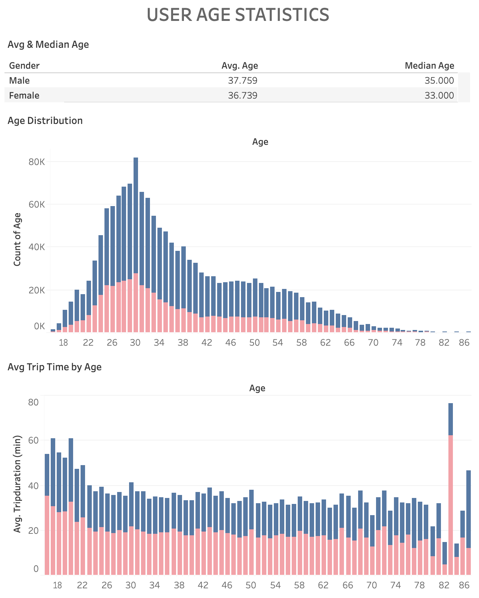

# Citi Bike Sharing Analysis
## Tableau Viz Link: 
##### https://public.tableau.com/profile/kiran.rangaraj#!/vizhome/Citi_Bike_Analytics_16135030171860/STORYCitiBikeAnalysis

---

## Summary ##
The New York Citi Bike Sharing Program first began operations on May 27, 2013, with 332 stations. The stations were located in Manhattan south of 59th Street and in Brooklyn north of Atlantic Avenue and west of Nostrand Avenue. Initially the system launched with 6,000 bicycles and is the largest of such sharing programs in the United States. The program has implemented a robust infrastructure for collecting data on its utilization, where bike data is collected, organized, and made public on the Citi Bike Data webpage each month.

This project involves aggregating data found in the Citi Bike Trip History Logs from November 2020 to build dashboards in order to illustrate unnexpected phenomena. A CSV file containing data for November 2020 was downloaded and then loaded into Tableau. New calculated fields were created from the raw data in order to assist in creating visualizations.

---

## Dashboard Visualizations Created ##
### Top 10 Starting Locations
* *Starting Location Comparitive Popularity Map*
* *Top 10 Start Station Map*
* *Number of Trips Started at Each Top 10 Station*
* *Top 10 Start Station Gender Demographics*
* *Top 10 Start Station Overall Gender Statistics*

### Top 10 Ending Locations
* *Ending Location Comparitive Popularity Map*
* *Top 10 End Station Map*
* *Number of Trips Ended at Each Top 10 Station*
* *Top 10 End Station Gender Demographics*
* *Top 10 End Station Overall Gender Statistics*

### Male versus Female Most Used Starting Locations
* *Male Most Used Start Station List*
* *Male Most Used Start Station Map*
* *Female Most Used Start Station List*
* *Female Most Used Start Station Map*

### Male versus Female Longest Trip Start Locations
* *Male Longest Trip Start Station List*
* *Male Top 10 Longest Trip Start Station Map*
* *Female Longest Trip Start Station List*
* *Female Top 10 Longest Trip Start Station Map*

### User Gender Statistics
* *User Type Count by Gender*
* *Overall Gender Count, Avg Age, & Avg Trip Time*
* *Gender Count per Day of Week*
* *Avg Trip Time by Hour of Day*
* *Number of Trips Started by Hour of Day*

### User Age Statistics
* *Avg & Median Age*
* *Age Distribution*
* *Avg Trip Time by Age*

### Most Used Bicycle Statistics
* *Top 10 Bicycles by Usage (Total Time)*
* *Top 10 Bicycles by Frequency (Count)*

---

## Analysis ##

  

The map denotes the usage of Start Stations by displaying the count of each start station by the magnitude and color of each circle. Bigger and warmer circles refer to a station being utilized more often than others. The bar chart below the map shows each individual station's usage by their count.

As we can see, 1 Ave & E 68 St is the topmost utilized station followed by W 21 St & 6 Ave, Broadway & W 60 St, and E 17 St & Broadway. These top stations seemed to be clustered around major areas of business.

The bar charts to the right of the map show the total count of male and female riders for each start station as well as their average age. All stations were used by more males than females, and these males tended to be slightly older than females, with the largest difference in age being 2.5 years at the W 21 St & 6 Ave station. Male ages ranged from 35-41 years old and female ages ranged from 34-39 years old. 

Interestingly, areas where males were older on average was similarly represented amongst females. This indicates that males and females of similar ages tend to live or work in the same areas. Overall, there was a 2:1 ratio of male to female riders who were on average 39 and 37 years old respectively. 

  

The map and corresponding bar chart show that 1 Ave & E 68 St remains the topmost utilized end station followed by W 21 St & 6 Ave, E 17 St & Broadway, and Broadway & W 60 St. These top stations again seemed to be clustered around major areas of business. The bottom stations are located in majority, outside of the inner-city district. 

One key aspect is that both the most used start stations and end stations are mirrored suggesting that these regions are key areas where bicycles should be more readily available for the higher population of users that are accessing them.

The gender breakdown bar chart shows similar rider statistics as the top start stations, where 2:1 user was male versus female who were on average 39 and 37 years old respectively.

  

The maps denote the usage of Start Stations for male and female users by displaying the count of each start station by the magnitude of each circle. Bigger circles refer to stations being utilized more often than others. The bar chart below the maps shows each individual station's usage by their count.

The top two most used stations W 21 St & 6 Ave and 1 Ave & E 68 St were the same for males and females. These stations were followed by more stations around Manhattan, the Flatiron District, Garment District, and Union Square that also overlap between males and females, but diverges around the Chelsea Region, where males frequented more, and the Financial District, where females frequented more. 

Overall, the top stations were used significantly more by males than females. All top 10 station for males were used over 4,000 times, with the lowest being 4,269. Whereas the most used station for females was accessed only 3,736 times by comparison. Additionally, the bar graph tooltip shows that males averaged much quicker trips from these stations. Males averaged trips between 12-18 minutes versus 16-25 minutes for females.

  

The maps denote the 10 Longest Trip Start Stations for male and female users by displaying the trip time of each start station by the magnitude of the circle. Bigger circles refer to stations of longer trip times than others. The bar chart below the map shows each individual station's ranking according to average trip time.

As we can see, there is no overlap between the top 10 stations for male users and female users. However, the longest rides tended to originate on the outer edges of the city regardless of gender. These stations were largely clustered above Manhattan in The Bronx and the remaining few below in Brooklyn.

When hovering over each bar, a tooltip reveals the total number of trips taken from each station. Interestingly, all of the stations had significantly lower usage than the most frequently used stations that are more centrally located in the city. Additionally, the data suggests that male riders tend to have longer rides than females. The longest trips for males averaged 8.3 hours for 80 trips taken versus almost 5 hours for 34 trips for females.

  

It is important to note that not all users have denoted whether they are male or female and those users were omitted from all except the top left chart which provides a gender breakdown of subscribers versus customers (guests). Unknown genders represent only 10% of the total number of users, which was over 1.7 million people. Of this total, over 1 million were male and 500,000 were female. 87% of males and 84% of females were subscribers as opposed to customers. 

The average age of males versus females only differed by 1 year, with males averaging 37.7 years old compared to 36.7 years old for females. Males tended to have faster trip times, averaging 17 minutes versus 19.5 minutes for females.

Overall ridership averaged 2:1 male to female for all days of the week, with the maximum riding day being Saturday and the minimum being Thursday. 

Longer rides tended to occur between 11 pm and 6 am for both genders. Interestingly however, females tended to take significantly longer rides than males during this time frame.

The ratio between male to female riders changed by hour of the day. Males took significantly more trips than females for all hours of the day, however this difference tended to get larger during commuting and daytime hours. Peak ridership occurs at 4 pm for both genders.

  

The user age distribution appears skewed right and ranges from 16-86 years old. There were more male users than female users for all ages except 82 and 87 years old. The average male user was 37.8 years old versus 36.7 years old for females. The median age for males was 35 years old and 33 years old for females. The mode age for both genders was 30 years old. 

Despite the much higher volume of male riders, female riders averaged longer trips for all ages under 66 years old. Of this higher age bracket, males aged 73, 75, 77, 80, 82, and 86 years old rode longer on average than females of the same age.

  

These two bar charts compare the top 10 bicycles by usage to the top 10 bicycles by frequency and reveals an inverse relationship between the two factors. Each 10 of the bicycles that have been ridden for the most amount of time also has a very few numbers of trips taken. In contrast, all 10 of the bicycles that have been ridden most frequently also have short overall usage times. 

This suggests that bicycles ridden longer may be traveling further away from the city which causes them to be returned to stations that are much less used. Additionally, these bicycles are likely to be due for maintenance or inspection due to normal wear and tear compared to the other bicycles that have accumulated less riding time and can remain active. In either case, the majority of users being downtown will not be able to use these bicycles, nor will any user be able to if Citi Bike has pulled them for servicing.

---

## Data Sources ##
* https://www.citibikenyc.com/system-data
* https://github.com/kiranrangaraj/tableau-CitiBike-analysis/tree/main/Resources

---

## Technologies Used ##
* Python
* Tableau
* CSV file
* Microsoft Word

---

## Author ##
* Kiran Rangaraj - Data Analytics Bootcamp - Vanderbilt University - 2021
